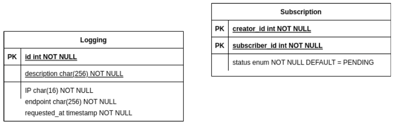

# BINOTIFY SOAP SERVICE
## Semester I Tahun 2022/2023
### Tugas Besar II IF3110 Milestone 1 Pengembangan Aplikasi Berbasis Web

*Program Studi Teknik Informatika*  
*Sekolah Teknik Elektro dan Informatika*  
*Institut Teknologi Bandung*  

*Semester I Tahun 2022/2023*

## Deskripsi
Binotify Soap Service merupakan Web Service berbasis protokol SOAP yang menyediakan layanan untuk memakai Web Method yang dimiliki oleh
Binotify. Web Service ini dibangun dengan menggunakan JAX WS dan di deploy dengan menggunakan maven.

## Fungsional Aplikasi
1. Melayani Permintaan Subscription
2. Mengapprove Subscription
3. Menolak Subscription
4. Melakukan pengecekan Subscription

## Author
1. Rayhan Kinan Muhannad (13520065)
2. Aira Thalca Avila Putra (13520101)
3. Marchotridyo (13520119)

  
## Basis Data Terkait

## Pembagian Kerja
- Setup Docker : 13520101
- Setup Database : 13520065
- Subscription Service : 13520101
- API Key : 13520119
